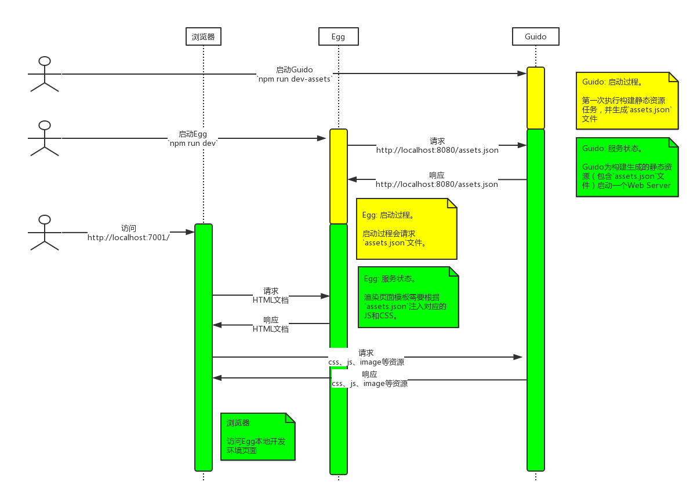

# goddess.daifee.com

基于Egg的一个Demo项目。本仓库包含“API服务”和“传统网站”的代码。


- [goddess.daifee.com](#goddessdaifeecom)
  - [TODO](#todo)
  - [目标](#%E7%9B%AE%E6%A0%87)
  - [快速入门](#%E5%BF%AB%E9%80%9F%E5%85%A5%E9%97%A8)
    - [本地开发](#%E6%9C%AC%E5%9C%B0%E5%BC%80%E5%8F%91)
    - [运行环境](#%E8%BF%90%E8%A1%8C%E7%8E%AF%E5%A2%83)
    - [指令说明](#%E6%8C%87%E4%BB%A4%E8%AF%B4%E6%98%8E)
    - [约定`app/assets/`目录](#%E7%BA%A6%E5%AE%9Aappassets%E7%9B%AE%E5%BD%95)
  - [Model](#model)
  - [API](#api)
    - [HTTP响应“规范”](#http%E5%93%8D%E5%BA%94%E8%A7%84%E8%8C%83)
    - [鉴权](#%E9%89%B4%E6%9D%83)
    - [api列表](#api%E5%88%97%E8%A1%A8)

## TODO

- [x] `/api/v1/users/:userId/micro-blogs/` 支持查询参数
- [x] 实现 `/api/admin/users/`
- [x] 实现 `/api/admin/blogs/`
- [x] `user`需要隐藏`phone`数据

## 目标

本项目提供API服务，然后基于API服务实现多个版本客户端：

1. [x] [传统网站（PC）](https://goddess.daifee.com/recommended/)
2. [ ] 单页应用（Mobile, React）
3. [ ] 同构应用（Mobile, React）
4. [ ] 微信小程序
5. [ ] Android应用
6. [ ] iOS应用
7. [ ] Windows桌面应用（Electron）
8. [ ] Mac桌面应用（Electron）


## 快速入门

> 先看一遍[Egg文档](https://eggjs.org/zh-cn/intro/)

为了更完善的“开箱即用”，集成Egg和[Guido](https://github.com/zuzucheFE/guido/)，定义`app/assets/`目录开发 JS/CSS，实现更简便的本地开发模式，新增一些基本功能和配置。


### 本地开发

本地开发需要启动3个服务：

1. Guido: 构建静态资源，并提供静态资源服务（webpack-dev-server）
2. Egg: 渲染页面，是一个“完整”的web-server（koa）
3. MongoDB: 数据持久化

> 安装MongoDB，根据`./config`创建本地开发和本地测试的用户帐号。然后执行下面指令
```bash
$ npm install
$ npm run dev
$ open http://localhost:7001/
```

**Egg与Guido交互时序图：**




### 运行环境

- local 本地开发环境
- sit 线上测试环境
- prod 生产环境
- test 单元测试环境


### 指令说明

- `npm run build` 执行构建任务（生产环境）
- `npm run start` 启动Egg服务（生产环境）
- `npm run stop` 停止Egg服务（生产环境）
- `npm run start-sit` 启动Egg服务（线上测试环境）
- `npm run stop-sit` 停止Egg服务（线上测试环境）
- `npm run dev` 启动本地开发服务（Egg和Guido）
- `npm run stop-dev`  停止本地开发服务（Guido）
- `npm run debug` 启动Egg服务（debug模式）
- `npm run test` 执行测试任务（lint, unittest）
- `npm run test-local` 执行单元测试任务
- `npm run build-assets-prod` 构建“生产环境”的静态资源包
- `npm run build-assets-sit` 构建“线上测试环境”的静态资源包


### 约定`app/assets/`目录

静态资源的源码放在`app/assets/`目录。

根据**webpack**的特性，我们**约定**为每个页面定义一个“静态资源”入口，所以约定了**页面目录结构**：`app/assets/page/$pageName/index.js`。

- `app/assets/page/$pageName/index.js` 每个页面必有，且唯一的“静态资源入口”。
- `$pageName` 开发者定义的页面名称。
- `index.js` `webpackage`配置的入口文件

> 约定的`$pageName`很重要，`controller`渲染模板需要用到。


## Model

- Label 标签
- Like 收藏
- MicroBlog 微博
- Picture 图片
- User 用户

> 项目用[mongoose](https://mongoosejs.com/)定义模型的`schema`。`app/model/*`源码简洁、清晰的描述了“数据结构”、“数据关系”、“数据约束”。

## API

### HTTP响应“规范”

API设计主要参考**RESTful**，然后稍作自定义。

**请求：**

1. `Content-Type`只支持`application/json`
2.

**响应：**

1. `Status Code`总是200
2. `Content-Type`总是`application/json`
3. `responseBody.code === 0`表示接口成功执行

响应体的结构：
```js
{
  code: 0, // 错误码（非0）
  data: null, // 业务数据
  message: '', // 提示信息
  stackId: '' // 错误栈ID
}
```

### 鉴权

在HTTP请求header附带用户`token`:

* `Authorization: Bearer {token}`


### api列表

源码对API的描述很清晰、简洁：

- `app/router.js` “传统网站”页面路由
- `api/router/v1.js` 面向用户的API，v1版
- `api/router/admin.js` 面向管理员的API
